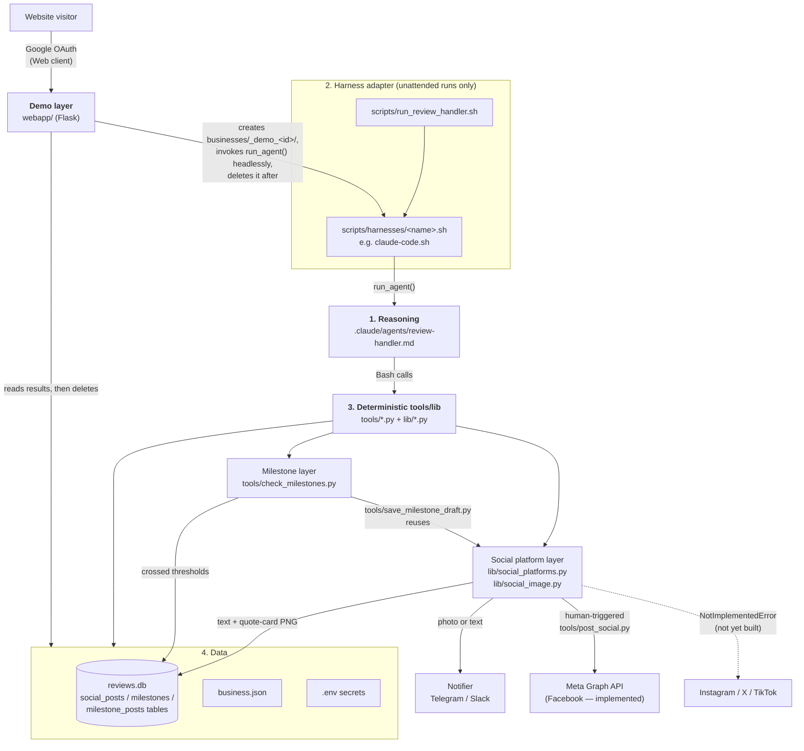

# Architecture: layers, and what's actually swappable

This system is built in four layers. Three of them have no dependency on any particular AI vendor or product at all — they're plain, deterministic code. Exactly one integration point is genuinely vendor-specific, and it's isolated to a single small directory on purpose, so changing it never touches the other three.

```
1. Reasoning / instructions   .claude/agents/review-handler.md (body)
2. Harness adapter            scripts/harnesses/*.sh
3. Deterministic tool/action  tools/*.py, lib/*.py
4. Data                       reviews.db, business.json, .env
```

Visually, with the social platform sub-layer (section 3) expanded to show where it goes once a caption is drafted:



## 1. Reasoning / instructions

The classification rubric, voice-matching guidance, and routing policy in `.claude/agents/review-handler.md` are ordinary prose — read the review, decide category/sentiment/urgency/confidence, draft a reply, apply the routing rules, call the right tool script. Nothing in that body assumes Claude Code specifically; any sufficiently capable agentic system with shell access could execute the same instructions.

The YAML frontmatter at the top of that file (`name:`, `description:`, `tools:`, `model:`) *is* Claude-Code-specific — it's how Claude Code's own subagent discovery mechanism registers the file. That's registration metadata, not logic. A second harness would carry its own registration in whatever format it requires, pointing at conceptually the same instructions - it wouldn't need to touch this file's frontmatter or body.

## 2. Harness adapter — the one swappable seam

This is where "which AI product actually runs the agent" lives, and it's deliberately isolated to `scripts/harnesses/`:

- **`scripts/harnesses/claude-code.sh`** — the only file in the repo that knows about the `claude` CLI. Defines `run_agent "<prompt>"`, today just `claude -p "$prompt" --permission-mode auto`.
- **`scripts/run_review_handler.sh`** — reads `AGENT_HARNESS` from the top-level `.env` (defaults to `claude-code`), sources the matching `scripts/harnesses/<name>.sh`, and calls `run_agent`. It never invokes a CLI binary directly itself.

**To add a second harness later** (Copilot, a local-LLM agent framework, anything else with shell/tool access): write `scripts/harnesses/<name>.sh` implementing the same `run_agent()` function however that harness needs to be invoked, set `AGENT_HARNESS=<name>` in `.env`, done. Nothing in `review-handler.md`, `tools/`, or `lib/` changes. `tools/check_health.py`'s "Agent harness" check confirms the configured name actually has a matching adapter file, so a typo or half-finished switch gets caught before the next unattended run rather than silently doing nothing.

**What this doesn't cover**: the *interactive* path — asking Claude Code directly, "run the review-handler agent" — has no repo-level script to abstract, since Claude Code's own subagent discovery is what's doing the invoking. Using a different product interactively means using that product's own equivalent mechanism, pointed at the same instructions. This seam is specifically about the unattended/scripted path (`scripts/run_review_handler.sh`, driven by `launchd` — see `docs/OPERATIONS.md` "Scheduling").

**`scripts/run_telegram_listener.sh` / `tools/telegram_listen.py` need no harness at all** — approve/reject/edit dispatch and the on-demand summary are pure rule-based Python (`lib/telegram_bot.py`), zero LLM involvement. Proof that layer 3 already stands on its own without layer 1/2 for anything that doesn't actually need judgment.

## 3. Deterministic tool/action layer

`tools/*.py` (thin CLI scripts) and `lib/*.py` (shared logic: `store.py`, `actions.py`, `google_client.py`, `notifier.py`, `telegram_bot.py`, `summary.py`, `config.py`) — all plain Python, stdlib only, no LLM calls anywhere. This is what the reasoning layer (1) calls into via Bash, and it's completely unaffected by which harness (2) is doing the calling. See the main [README](../README.md) for the full file-by-file breakdown.

### Social platform layer — draft formatting today, a posting seam for later

Every 5-star review gets one agent-drafted caption (`tools/save_social_draft.py`, Step 5 of `review-handler.md`) — that part of the reasoning layer doesn't change. What happens to that one caption next is its own small adapter within this layer, `lib/social_platforms.py`, same shape as the harness/notifier seams above: a `SocialPlatform` ABC plus a `_PLATFORMS` registry dict (`facebook`, `instagram`, `twitter`, `tiktok` today). Adding a platform is a new class and one registry line — nothing else changes.

**Today (Phase 1, draft-only)**: `SocialPlatform.render(caption, hashtags)` reformats the one base caption per platform's own hashtag count and character limit (trimming hashtags first, only truncating the caption itself as a last resort, never mid-word). Each platform also has `render_image()`, which calls `lib/social_image.py`'s `render_quote_card()` to rasterize a branded testimonial-style PNG (the review's own quote, a star rating, the business's logo/name) at that platform's own aspect ratio (Facebook 1200×630, Instagram 1080×1080, X/Twitter 1200×675, TikTok 1080×1920 — vertical). `save_social_draft.py` calls both for every platform a business has enabled (`business.json`'s optional `social_platforms` allow-list, default: all registered platforms), stores each text variant and image path in the `social_posts` table (one row per review × platform), and sends each platform's result through every configured notification channel — as a photo with a caption where the image rendered, plain text otherwise (`Notifier.send_photo()`, see below). The `social_hashtags` key in `business.json` is the shared, ordered hashtag pool each platform draws its own prefix from; `brand_color`/`brand_text_color`/`logo_path` (`businesses/<slug>/logo.png`)/`brand_font_path` control the quote card's look. Nothing here calls any social platform's API — same "draft-only" posture `save_social_draft.py` has always documented.

**The one non-stdlib dependency in this repo**: every other `lib/*.py` file is stdlib-only by design (see `lib/google_client.py`/`lib/notifier.py`) — `lib/social_image.py` is a deliberate exception, using Pillow (`requirements.txt`) because there's no reasonable way to rasterize text/logos into a PNG with the standard library alone. `tools/check_health.py`'s "Social platforms" check WARNs (not FAILs) if Pillow isn't installed — text captions still draft fine without it, only the images don't generate.

**Photo delivery**: `Notifier.send_photo(path, caption)` (`lib/notifier.py`) defaults to falling back to a plain text message noting an image was drafted — most channels (Slack incoming webhooks included) can't upload files at all. `TelegramNotifier` overrides it with a real `sendPhoto` call, via a small stdlib multipart/form-data POST helper (`post_multipart`) alongside the existing JSON one.

**Phase 2 (real auto-posting)**: `SocialPlatform.post(business, image_path, caption)` is the seam — each platform implements it against its real API once that platform's credentials exist, and a human explicitly triggers it via `tools/post_social.py --review-id <id> --platform <name>` (mirroring `tools/approve.py`'s human-in-the-loop shape — the agent drafts and formats, a person decides whether to actually publish to public social media). Nothing posts automatically; the review-handler agent never calls `post()` itself.

- **Facebook — implemented.** `FacebookPlatform.post()` calls the Meta Graph API (`POST /{page-id}/photos`, currently targeting `v25.0`) via `lib/notifier.py`'s `post_multipart()` helper (the same stdlib multipart uploader Telegram's `sendPhoto` uses). Credentials are `FACEBOOK_PAGE_ID`/`FACEBOOK_PAGE_ACCESS_TOKEN` in `businesses/<slug>/.env`, read via `Business.facebook_page_id`/`facebook_page_access_token` (same `_secret()` pattern as the Google OAuth fields). `tools/meta_oauth_setup.py` (mirroring `google_oauth_setup.py`) is how a business gets these: a self-serve, per-business browser authorization via **Facebook Login for Business**, chosen specifically because this platform is multi-tenant — a plain Meta System User token would require every independent business to have their own Meta Business Manager setup, which doesn't scale to onboarding. The resulting token is a business-integration system-user token that, per Meta's docs, "defaults to never expire" for server-to-server use, unlike a plain personal-user-derived token. `tools/check_health.py`'s "Facebook posting" check round-trips it against the API, same pattern as the Google OAuth check.
- **Instagram — credential captured, posting not implemented.** `tools/meta_oauth_setup.py` also discovers and saves `INSTAGRAM_BUSINESS_ACCOUNT_ID` when a business's Facebook Page has one linked (Instagram posting authorization rides the same Facebook Login for Business flow and reuses the same Page token — no separate per-business setup needed). `InstagramPlatform.post()` still raises `NotImplementedError`: Instagram's publish API (`POST /{ig-user-id}/media`) only accepts a publicly-reachable `image_url` that Instagram's own servers fetch, unlike Facebook's direct binary upload — the quote-card PNGs this repo generates only exist as local files (`businesses/<slug>/social_images/`), so Instagram posting is blocked on solving public image hosting first, a separate piece of infrastructure work.
- **WhatsApp — not part of this seam.** It shares the same underlying Meta Business Portfolio concept, but its onboarding (Embedded Signup, phone number/WABA registration) and shape (conversational messaging, not content publishing) don't fit `SocialPlatform` at all — closer to a future `Notifier`-style channel or a distinct customer-messaging feature, not built here.
- **X/Twitter, TikTok — not yet implemented, and not Meta products.** Same `post()` seam, still raising `NotImplementedError` until each platform's own (unrelated) credentials and API call are wired up.

`social_posts.status`/`external_post_id`/`posted_at` (set by `tools/post_social.py` via `store.mark_social_post_posted()`) already existed from Phase 1, so wiring up a platform needs no schema change.

### Milestone layer — celebrating totals, streaks, and anniversaries

A sibling of the social platform layer above, sharing its rendering/drafting/posting machinery but triggered by the business's aggregate history instead of one specific review. `tools/check_milestones.py` is a thin CLI wrapper (same tools/lib split as `tools/post_reply.py` around `lib/actions.py`) around `lib/milestones.py::check_milestones()`, run once per review-handler cycle (right after `tools/fetch_reviews.py`, whether or not that run found any new reviews). It detects three independent milestone types, each derived fresh from the `reviews` table every run rather than tracked as a separately mutable counter that could drift:

- **`review_count`** (on by default): a running count of total reviews crossing a configured threshold (`business.json`'s `milestone_thresholds`, defaulting to `[50, 100, 250, 500, 1000, 2500, 5000, 10000]` even if unset).
- **`rating_streak`** (opt-in, no-op until set): consecutive 5-star reviews in a row crossing a configured length (`rating_streak_milestones`). Chosen over a rolling average-rating threshold deliberately — an average can cross a line and later cross back below it as new reviews arrive, which would make "have we already posted this" genuinely ambiguous; a streak only ever grows or resets to zero, so it can never un-cross a threshold it already hit.
- **`anniversary`** (opt-in, no-op until set): whole years elapsed since `founded_date` (`YYYY-MM-DD` in `business.json`). Computed as elapsed-days-since-founding rather than an exact date match, so a scheduled run that's late by a day or two still catches the anniversary instead of silently sailing past it.

Detection walks the reviews table in chronological order (`lib/store.py`'s `list_reviews_chronological()`), updating a running count/streak review-by-review and checking configured thresholds as it goes — not a simple before/after diff of totals, which would misattribute (or miss entirely) a threshold crossed mid-batch, e.g. a single fetch that jumps the count from 497 straight to 505, or a streak that spikes and breaks within one day's batch of new reviews.

Each newly-crossed milestone is recorded in the `milestones` table (`type`, `threshold`, the review that reached it if any, `UNIQUE(type, threshold)` — the actual idempotency guard, not any check-then-record logic in the script). The review-handler agent drafts a caption for each one in the business's voice (same reviewer-anonymity rule as a compliment caption) and calls `tools/save_milestone_draft.py --milestone-id <id> --caption "..."`, which renders a per-platform milestone card (`lib/social_image.py`'s `render_milestone_card()` — a big headline instead of a review quote, since no single review is "the" story) into the `milestone_posts` table, the milestone equivalent of `social_posts`. Publishing is the identical human-triggered step as a review's social draft: `tools/post_social.py --milestone-id <id> --platform <name>` (mutually exclusive with `--review-id` in the same script — one small extension, not a parallel posting path).

### Demo layer — a personalized live preview, not a canned example

`webapp/` is a small Flask app (this repo's second deliberate non-stdlib dependency, same reasoning as Pillow — see `requirements.txt`) that lets a website visitor try the product against their **own** real Google reviews before signing up for anything, rather than a generic mock-data walkthrough. It's deliberately a separate app from `tools/`/`lib/`'s CLI-oriented design, not a rewrite of it — every existing piece (`LiveGoogleBusinessProfileClient`, `lib/store.py`, every `tools/*.py` script, `review-handler.md` itself) runs completely unmodified underneath it.

**The trick that makes reuse possible**: `webapp/demo.py` creates a throwaway `businesses/_demo_<uuid>/` directory (`business.json` + `.env`) from the visitor's freshly-authorized credentials, points the existing `--business _demo_<uuid>` machinery at it, and deletes the whole directory in a `finally` block once the run finishes. Nothing downstream needs to know it's a demo — as far as `lib/google_client.py` or `review-handler.md` can tell, it's just one more business.

**OAuth is a separate client from the CLI onboarding path.** `tools/google_oauth_setup.py` uses a Desktop-app OAuth client (a script catching a `localhost` redirect, per `docs/API_SETUP.md`) — that pattern doesn't work for a browser-based flow. `webapp/google_oauth.py` uses a second, **Web-application**-type client (`GOOGLE_WEB_OAUTH_CLIENT_ID`/`_SECRET`, top-level `.env` only, see `.env.example`) with a real HTTPS redirect handled by `webapp/app.py`'s `/demo/oauth/callback` route. Both clients live in the same already-approved Google Cloud project; only the client type and redirect mechanism differ. Until Google's OAuth consent screen moves from Testing to Production status (a separate, one-time verification track — see `docs/ONBOARDING.md`/the platform's own onboarding notes), this only works for Google accounts manually added as test users, exactly like the CLI path already requires — production verification removes that restriction for both paths at once, no code change needed here when it lands.

**Safety guardrails, since this runs against a stranger's live Google listing**:
- The agent invocation (`webapp/demo._build_demo_prompt()`) explicitly forbids `tools/post_reply.py`, `tools/notify.py`, and `tools/send_daily_summary.py` regardless of routing status — a visitor who clicked "try the demo" has not agreed to anything being posted to their real listing. `tools/save_social_draft.py` is safe to run as-is; it's draft-only by its own design regardless of caller.
- The visitor's refresh token is never logged and never persisted anywhere beyond that one ephemeral `.env`, deleted synchronously after the run plus swept on the next server startup (`demo.sweep_stale_demo_dirs()`) as a backstop against a crash mid-request.
- `demo.run_demo()` is serialized by a module-level lock, and `app.run()` is started with `threaded=False` — `lib/config.py`'s active-business selection is a process-global (`config.use_business()`), fine for the one-process-one-business-at-a-time CLI tools this repo was built around, but unsafe for two concurrent demo requests in the same process. Acceptable at "local machine + tunnel" scale; would need real fixing before any concurrent-traffic deployment.
- A results page always states plainly that nothing was posted, regardless of what routing decision each review got — Google's own consent screen already discloses the `business.manage` scope being granted, so this is a second, plain-language layer of the same disclosure, not a substitute for it.

**Explicitly not part of this layer yet**: production hosting (local + an HTTPS tunnel like ngrok only, per `DEMO_PUBLIC_BASE_URL` in `.env.example`), a Meta/Facebook equivalent (the same ephemeral-directory pattern extends to it later with no architectural change), and any real lead-management system beyond an append-only `leads.jsonl`.

## 4. Data

Per-business SQLite DB (`businesses/<slug>/reviews.db`), structured facts (`business.json`), and secrets (`businesses/<slug>/.env`) — see `docs/OPERATIONS.md` and the README's "Configuration" section. Unaffected by any of the above.
